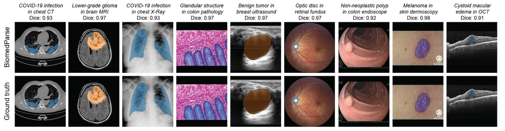

# **BiomedParse**

This repository hosts the code and resources for the paper **"A Foundation Model for Joint Segmentation, Detection, and Recognition of Biomedical Objects Across Nine Modalities"** (published in [*Nature Methods*](https://aka.ms/biomedparse-paper)).

[[`Paper`](https://aka.ms/biomedparse-paper)] [[`Demo`](https://microsoft.github.io/BiomedParse/)] [[`Model`](https://huggingface.co/microsoft/BiomedParse)]  [[`Data`](https://huggingface.co/datasets/microsoft/BiomedParseData)]  [[`BibTeX`](#Citation)]

**BiomedParse** is designed for comprehensive biomedical image analysis. It offers a unified approach to perform **segmentation**, **detection**, and **recognition** across diverse biomedical imaging modalities. By consolidating these tasks, BiomedParse provides an efficient and flexible tool tailored for researchers and practitioners, facilitating the interpretation and analysis of complex biomedical data.



## News
- Dec. 5, 2024: The loading process of target_dist.json is optimized by automatic downloading from HuggingFace.
- Dec. 3, 2024: We added inference notebook examples in inference_example_RGB.ipynb and inference_example_NIFTI.ipynb
- Nov. 22, 2024: We added negative prediction p-value example in inference_example_DICOM.ipynb
- Nov. 18, 2024: BiomedParse is officially online in [*Nature Methods*](https://aka.ms/biomedparse-paper)!

## Installation
```sh
git clone https://github.com/microsoft/BiomedParse.git
```

[Notice] If inference_utils/target_dist.json is not cloned correctly, it will be automatically loaded from HuggingFace when needed.

### Conda Environment Setup
#### Option 1: Directly build the conda environment
Under the project directory, run
```sh
conda env create -f environment.yml
```

#### Option 2: Create a new conda environment from scratch
```sh
conda create -n biomedparse python=3.9.19
conda activate biomedparse
```

Install Pytorch
```sh
conda install pytorch torchvision torchaudio pytorch-cuda=12.4 -c pytorch -c nvidia
```
In case there is issue with detectron2 installation, make sure your pytorch version is compatible with CUDA version on your machine at https://pytorch.org/.

Install dependencies
```sh
pip install -r assets/requirements/requirements.txt
```

## Dataset
BiomedParseData was created from preprocessing publicly available biomedical image segmentation datasets. Check a subset of our processed datasets on HuggingFace: https://huggingface.co/datasets/microsoft/BiomedParseData. For the source datasets, please check the details here: [BiomedParseData](assets/readmes/DATASET.md). As a quick start, we've samples a tiny demo dataset at biomedparse_datasets/BiomedParseData-Demo

## Model Checkpoints
We host our model checkpoints on HuggingFace here: https://huggingface.co/microsoft/BiomedParse.

Step 1. Create pretrained model folder
```
mkdir pretrained
```
Step 2. Download model checkpoint and put the model in the pretrained folder when running the code. Change file name to biomed_parse.pt

Expect future updates of the model as we are making it more robust and powerful based on feedbacks from the community. We recomment using the latest version of the model.

## Running Inference with BiomedParse

We’ve streamlined the process for running inference using BiomedParse. Below are details and resources to help you get started.

### How to Run Inference
To perform inference with BiomedParse, use the provided example code and resources:

- **Inference Code**: Use the example inference script in `example_prediction.py`.
- **Sample Images**: Load and test with the provided example images located in the `examples` directory.
- **Model Configuration**: The model settings are defined in `configs/biomedparse_inference.yaml`.

### Example Notebooks

We’ve included sample notebooks to guide you through running inference with BiomedParse:

- **DICOM Inference Example**: Check out the `inference_examples_DICOM.ipynb` notebook for example using DICOM images.
- You can also try a quick online demo: [](https://colab.research.google.com/github/microsoft/BiomedParse/blob/main/inference_colab_demo.ipynb)

### Model Setup
```sh
from PIL import Image
import torch
from modeling.BaseModel import BaseModel
from modeling import build_model
from utilities.distributed import init_distributed
from utilities.arguments import load_opt_from_config_files
from utilities.constants import BIOMED_CLASSES
from inference_utils.inference import interactive_infer_image
import numpy as np

# Build model config
opt = load_opt_from_config_files(["configs/biomedparse_inference.yaml"])
opt = init_distributed(opt)

# Load model from pretrained weights
#pretrained_pth = 'pretrained/biomed_parse.pt'
pretrained_pth = 'hf_hub:microsoft/BiomedParse'

model = BaseModel(opt, build_model(opt)).from_pretrained(pretrained_pth).eval().cuda()
with torch.no_grad():
    model.model.sem_seg_head.predictor.lang_encoder.get_text_embeddings(BIOMED_CLASSES + ["background"], is_eval=True)
```

### Segmentation On Example Images
```sh
# RGB image input of shape (H, W, 3). Currently only batch size 1 is supported.
image = Image.open('examples/Part_1_516_pathology_breast.png', formats=['png'])
image = image.convert('RGB')
# text prompts querying objects in the image. Multiple ones can be provided.
prompts = ['neoplastic cells', 'inflammatory cells']

# load ground truth mask
gt_masks = []
for prompt in prompts:
    gt_mask = Image.open(f"examples/Part_1_516_pathology_breast_{prompt.replace(' ', '+')}.png", formats=['png'])
    gt_mask = 1*(np.array(gt_mask.convert('RGB'))[:,:,0] > 0)
    gt_masks.append(gt_mask)

pred_mask = interactive_infer_image(model, image, prompts)

# prediction with ground truth mask
for i, pred in enumerate(pred_mask):
    gt = gt_masks[i]
    dice = (1*(pred>0.5) & gt).sum() * 2.0 / (1*(pred>0.5).sum() + gt.sum())
    print(f'Dice score for {prompts[i]}: {dice:.4f}')
```


Detection and recognition inference code are provided in `inference_utils/output_processing.py`.

- `check_mask_stats()`: Outputs p-value for model-predicted mask for detection.
- `combine_masks()`: Combines predictions for non-overlapping masks.

## Finetune on Your Own Data
While BiomedParse can take in arbitrary image and text prompt, it can only reasonably segment the targets that it has learned during pretraining! If you have a specific segmentation task that the latest checkpint doesn't do well, here is the instruction on how to finetune it on your own data.

### Raw Image and Annotation
BiomedParse expects images and ground truth masks in 1024x1024 PNG format. For each dataset, put the raw image and mask files in the following format
```
├── biomedparse_datasets
    ├── YOUR_DATASET_NAME
        ├── train
        ├── train_mask
        ├── test
        └── test_mask
```
Each folder should contain .png files. The mask files should be binary images where pixels != 0 indicates the foreground region.

### File Name Convention
Each file name follows certain convention as

[IMAGE-NAME]\_[MODALITY]\_[SITE].png

[IMAGE-NAME] is any string that is unique for one image. The format can be anything.
[MODALITY] is a string for the modality, such as "X-Ray"
[SITE] is the anatomic site for the image, such as "chest"

One image can be associated with multiple masks corresponding to multiple targets in the image. The mask file name convention is

[IMAGE-NAME]\_[MODALITY]\_[SITE]\_[TARGET].png

[IMAGE-NAME], [MODALITY], and [SITE] are the same with the image file name.
[TARGET] is the name of the target with spaces replaced by '+'. E.g. "tube" or "chest+tube". Make sure "_" doesn't appear in [TARGET].

### Get Final Data File with Text Prompts
In biomedparse_datasets/create-customer-datasets.py, specify YOUR_DATASET_NAME. Run the script with
```
cd biomedparse_datasets
python create-customer-datasets.py
```
After that, the dataset folder should be of the following format
```
├── dataset_name
        ├── train
        ├── train_mask
        ├── train.json
        ├── test
        ├── test_mask
        └── test.json
```

### Register Your Dataset for Training and Evaluation
In datasets/registration/register_biomed_datasets.py, simply add YOUR_DATASET_NAME to the datasets list. Registered datasets are ready to be added to the training and evaluation config file configs/biomed_seg_lang_v1.yaml. Your training dataset is registered as biomed_YOUR_DATASET_NAME_train, and your test dataset is biomed_YOUR_DATASET_NAME_test.


## Train BiomedParse
To train the BiomedParse model, run:

```sh
bash assets/scripts/train.sh
```
This will continue train the model using the training datasets you specified in configs/biomed_seg_lang_v1.yaml

## Evaluate BiomedParse
To evaluate the model, run:
```sh
bash assets/scripts/eval.sh
```
This will continue evaluate the model on the test datasets you specified in configs/biomed_seg_lang_v1.yaml. We put BiomedParseData-Demo as the default. You can add any other datasets in the list.

<!-- ### Install Docker

In order to make sure the environment is set up correctly, we use run BiomedParse on a Docker image. Follow these commands to install Docker on Ubuntu:

```sh
sudo apt update
sudo apt install apt-transport-https ca-certificates curl software-properties-common
curl -fsSL https://download.docker.com/linux/ubuntu/gpg | sudo apt-key add -
sudo add-apt-repository "deb [arch=amd64] https://download.docker.com/linux/ubuntu $(lsb_release -cs) stable"
sudo apt update
apt-cache policy docker-ce
sudo apt install docker-ce
```

## Prepare Docker Environment

Specify the project directories in `docker/README.md`.

Run the following commands to set up the Docker environment:

```sh
bash docker/docker_build.sh
bash docker/docker_run.sh
bash docker/setup_inside_docker.sh
source docker/data_env.sh
``` -->

## Citation

Please cite our paper if you use the code, model, or data.

```bibtex
@article{zhao2024biomedparse,
  title = {A foundation model for joint segmentation, detection, and recognition of biomedical objects across nine modalities},
  author = {Zhao, Theodore and Gu, Yu and Yang, Jianwei and Usuyama, Naoto and Lee, Ho Hin and Kiblawi, Sid and Naumann, Tristan and Gao, Jianfeng and Crabtree, Angela and Abel, Jacob and Moung-Wen, Christine and Piening, Brian and Bifulco, Carlo and Wei, Mu and Poon, Hoifung and Wang, Sheng},
  journal = {Nature Methods},
  year = {2024},
  publisher = {Nature Publishing Group UK London},
  url = {https://www.nature.com/articles/s41592-024-02499-w},
  doi = {10.1038/s41592-024-02499-w}
}
```

## Usage and License Notices
The model described in this repository is provided for research and development use only. The model is not intended for use in clinical decision-making or for any other clinical use, and the performance of the model for clinical use has not been established. You bear sole responsibility for any use of this model, including incorporation into any product intended for clinical use.
# bio_parse
